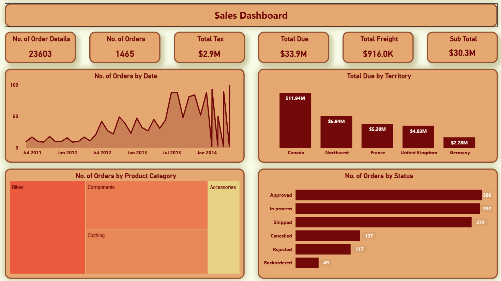
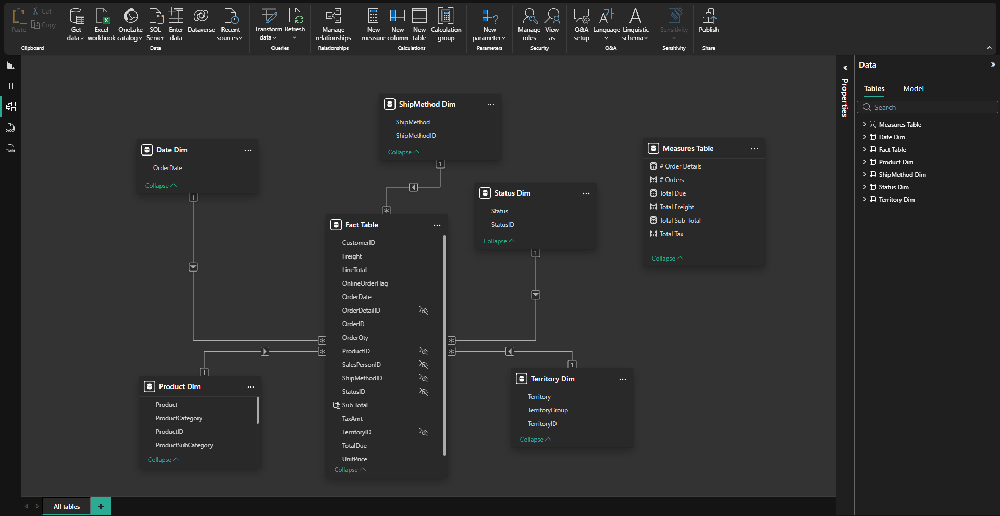
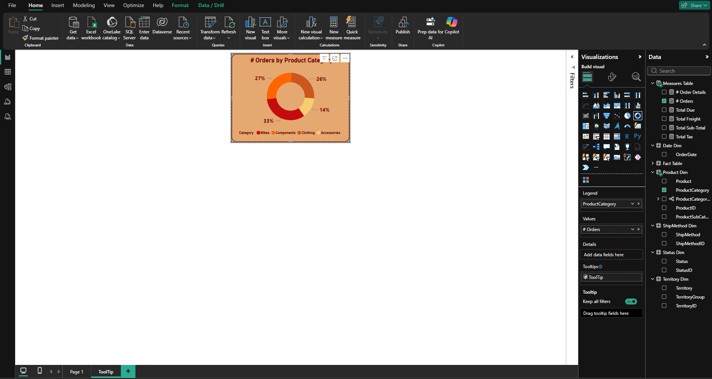

# 📊 Sales Analysis Dashboard
> A Power BI dashboard for analysing sales performance across territories, categories, and time.

---

## 🖼️ Dashboard Preview



---

## 🗂️ Overview

This Power BI dashboard was built using `Sales.xlsx` as the data source. It provides an interactive view of sales orders, revenue, tax, freight, and product performance — all in one place.

---

## 📁 Project Structure

```
Sales-Analysis/
│
├── README.md
├── SalesDashboard.pbix
│
├── Data/
│   └── Sales.xlsx
│
└── Screenshots/
    ├── Dashboard.png
    ├── Dashboard_ToolTip.png
    ├── ModelView.png
    └── ToolTip.png
```

---

## 🧩 Data Model — Star Schema



The data is structured using a **Star Schema** with one central Fact table connected to Dimension tables:

| Table | Type |
|---|---|
| `Fact Table` | Fact — core transactions |
| `Product Dim` | Product, Category, SubCategory |
| `Territory Dim` | Territory, TerritoryGroup |
| `Date Dim` | OrderDate |
| `Status Dim` | Status, StatusID |
| `ShipMethod Dim` | ShipMethod, ShipMethodID |
| `Measures Table` | All DAX measures |

---

## 📐 DAX Measures

All measures are stored in a dedicated **Measures Table**:

```dax
# Orders        = DISTINCTCOUNT(Fact[OrderID])
# Order Details = DISTINCTCOUNT('Fact Table'[OrderDetailID])
Total Sub-Total = SUM(Fact[Sub Total])
Total Tax       = SUM(Fact[TaxAmt])
Total Freight   = SUM(Fact[Freight])
Total Due       = SUM(Fact[TotalDue])
```

---

## ✅ KPI Card Values

| Card | Value |
|---|---|
| # Order Details | 23,603 |
| # Orders | 1,465 |
| Total Sub-Total | $30.3M |
| Total Tax | $2.9M |
| Total Freight | $916.0K |
| Total Due | $33.9M |

---

## 📊 Visuals

| Visual | Description |
|---|---|
| 6 KPI Cards | Key metrics displayed at the top |
| Orders by Date | Line chart showing order trends over time (2011–2014) |
| Total Due by Territory | Bar chart comparing revenue by region |
| Orders by Product Category | Treemap showing Bikes, Components, Clothing, Accessories |
| Orders by Status | Bar chart showing Approved, Shipped, Cancelled, etc. |

---

## 🔍 Tooltip Page


A custom **Tooltip Page** displays a doughnut chart showing **# Orders by Product Category** when hovering over visuals.



The tooltip uses `ProductCategory` as the legend and `# Orders` as the value, giving instant category breakdowns on hover.

---

## 🛠️ Tools Used

- **Power BI Desktop** — dashboard and data model
- **Microsoft Excel** — source data (`Sales.xlsx`)
- **DAX** — custom measures
- **Power Query** — data transformation and cleaning

---

*Sales Analysis Dashboard — Power BI Project | Last Updated: 2026-03-30*
